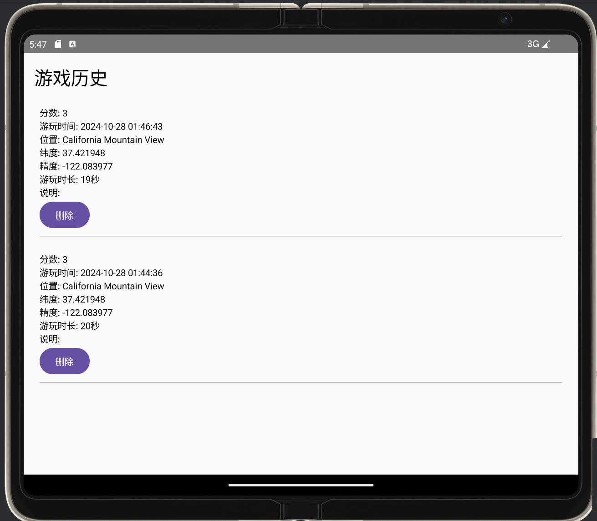

# FlappyBird Android

这是**上海理工大学移动应用开发**课程的课堂作业，课程要求：`开发一款简单的手机小游戏，要求调用第三方的sdk实现定位动能，并且将游戏数据上传到服务器，并且制作可视化页面展示游戏数据`

我此处调用的sdk为高德地图的sdk，需要到高德地图官网申请key，填写到`AndroidManifest.xml`文件的`value`当中来实现定位服务的调用，后端代码开源在了https://github.com/caodong0225/FlappyBirdAndroid_backend

上，一个`springboot`写的非常简单的后端页面，访问

http://localhost:8080/doc.html

查看接口文档

效果演示：

游戏结束页面

游戏开始页面

点击菜单可以看到游玩历史的数据

